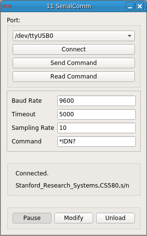

### Serial Communication Emulator

**Requirements:** Serial       
**Limitations:** Non-RT  

<!--start-->
Control serial interface devices through RTXI. Commands must be configured by the user for the specific instrument being controlled.
<!--end-->

#### Input Channels
None  

#### Output Channels
None

#### Parameters
1. Baud Rate (bps)
2. Timeout - (Int) connection timeout  
3. Sampling Rate (Hz)
4. Serial Command

#### States
None  
